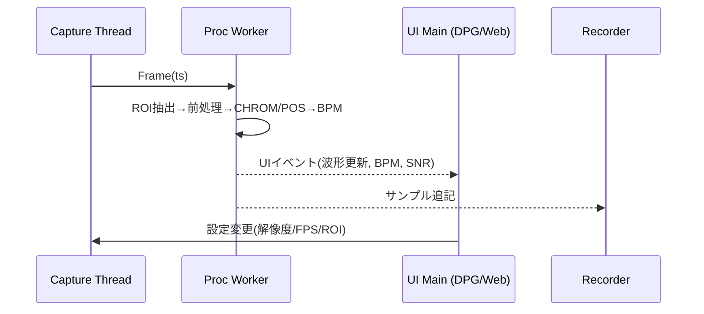
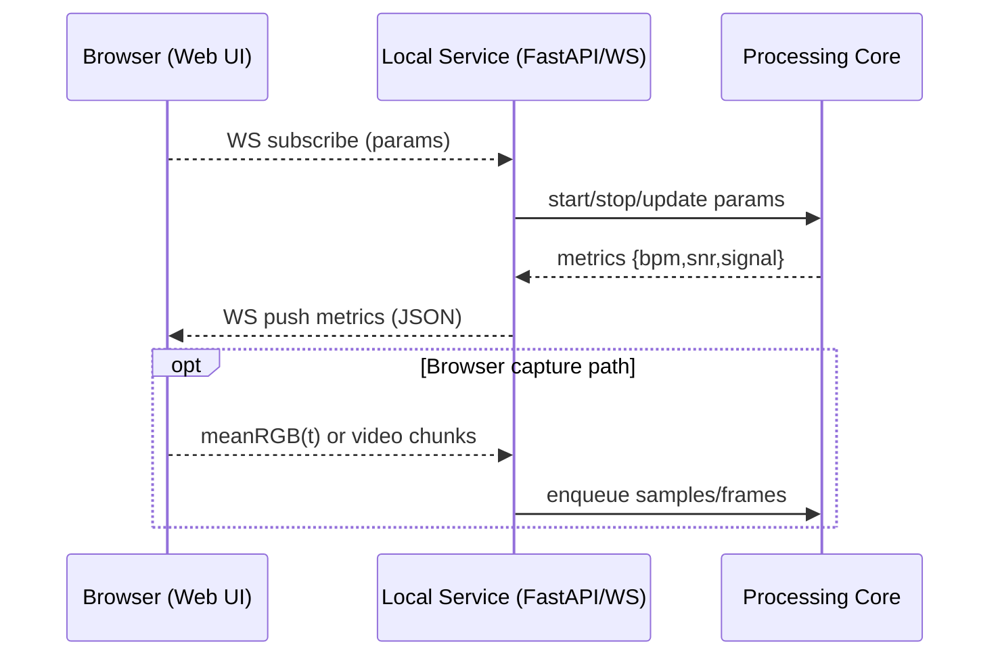

## rPPG デスクトップ/ブラウザ対応 設計

最終更新: 2025-08-26

本設計は uv + DearPyGUI を前提に、将来的なブラウザUI対応（Web）も見据えた拡張可能なアーキテクチャを示す。内蔵カメラから rPPG（CHROM/POS）を推定し BPM を表示・保存する。

## 全体アーキテクチャ（マルチフロントエンド）
```mermaid
flowchart TD
  subgraph Core[Processing Core]
    CAP[Capture Layer]
    ROI[ROI/Face Tracking]
    CORE[rPPG Core\n(Preprocess, CHROM/POS, Filter)]
    REC[Recorder\n(CSV/JSON)]
    CAP -->|Frame (BGR, ts)| ROI -->|ROI mean RGB, ts| CORE --> REC
  end
  subgraph Frontends
    DPG[Desktop UI\n(DearPyGUI)]
    WEB[Web UI\n(Browser)]
  end
  CORE -->|signal window, BPM, SNR| DPG
  CORE <-->|WS/HTTP JSON| WEB
  CAP -. optional .->|Browser getUserMedia| WEB
```

- Capture: カメラからフレーム＋タイムスタンプ取得、FPS計測
- ROI: 顔検出/ランドマーク、スキンマスク生成、複数パッチの追跡
- Core: 正規化・バンドパス・CHROM/POS合成・BPM推定・品質指標
- UI: プレビュー（ROI重畳）、波形/スペクトル、BPM/品質、設定（Desktop/Web いずれでも）
- Recorder: R/G/B 平均、rPPG、BPM を非同期保存

## スレッド/非同期モデル

- UIスレッドは描画と操作に限定。処理はWorkerで実行（`queue.Queue` で受け渡し）。
- 設定変更はスレッドセーフな共有構造（`dataclasses` + `threading.Lock`）で反映。

### キュー/同期の詳細
- フレーム受け渡し: `queue.Queue[maxsize=2]`（上書き/最新優先のため `put_nowait` + `get_nowait` で間引き）
- サンプル受け渡し: `collections.deque(maxlen=N_win*fps*1.5)`（窓長の1.5倍余裕）
- UIイベント: `Queue` でメトリクスをバースト抑制（200msデバウンス）して描画スレッドに送出
- ストップシグナル: `threading.Event`（`stop_event.is_set()` を各ループで監視）

### Web 経路の追加（将来・現時点では非実施）

- 近接/ローカル運用ではコアがカメラを直接使用し、Browser はメトリクス受信主体。（現時点ではWeb連携は非実施）
- ブラウザでの映像取得が必要な場合は `getUserMedia` → `RTC/WS` を想定。（将来検討）

## モジュール構成（`src/` 提案）
```
src/
  rppg/
    __init__.py
    capture.py        # OpenCV カメラ制御, FPS, 色空間変換
    roi.py            # MediaPipe顔検出/ランドマーク, スキンマスク, パッチ定義
    preprocess.py     # 正規化(移動平均), バンドパス(FIR/IIR)
    chrom.py          # CHROM 合成
    pos.py            # POS 合成
    bpm.py            # スペクトル/ピークトラッキング, BPM計算
    quality.py        # SNR等の品質指標
    recorder.py       # CSV/JSON 非同期書き込み
    app.py            # DearPyGUI エントリ, ループ, 配線
    service.py        # FastAPI/WebSocket サービス（Webフロント連携）
web/
  frontend/          # 将来: Web UI（静的アセット or SPA）
```

## コンポーネント責務（概要）
- `capture.py`: デバイス列挙、解像度/FPS設定、BGR→RGB変換、タイムスタンプ付与。
- `roi.py`: MediaPipe により顔矩形/ランドマーク抽出、頬/額マスク生成、安定化（前回追従）。
- `preprocess.py`: DC除去（移動平均）とバンドパス（IIR推奨）、正規化スケーリング。
- `chrom.py` / `pos.py`: 時系列RGBから単一rPPG信号へ合成、数式は 02 を遵守。
- `bpm.py`: スペクトル推定、ピーク選択、BPM平滑化（EMA/メディアン）。
- `quality.py`: SNR、有効ピーク幅、トラッキング一貫性から品質メトリクスを算出。
- `recorder.py`: CSV/JSON メタの非同期書込、ローテーション、クラッシュ安全化（flush）。
- `app.py`: DearPyGUI 初期化、イベント配線、ワーカー起動/停止、描画更新の節流制御。
- `service.py`: FastAPI + WS、現在値取得、購読管理、CORS/レート制御。

## インターフェース/関数シグネチャ（案）
```python
# capture.py
@dataclass
class CaptureConfig:
    device: int = 0
    width: int = 640
    height: int = 480
    fps: float = 30.0

class Camera:
    def __init__(self, cfg: CaptureConfig): ...
    def start(self) -> None: ...  # spawn thread
    def stop(self) -> None: ...
    def read(self) -> tuple[np.ndarray, float] | None: ...  # (BGR, ts)

# roi.py
@dataclass
class RoiResult:
    mask: np.ndarray  # HxW bool
    landmarks: np.ndarray | None
    valid: bool

def compute_roi(frame_bgr: np.ndarray) -> RoiResult: ...
def mean_rgb(frame_bgr: np.ndarray, mask: np.ndarray) -> tuple[float, float, float]: ...

# preprocess.py
def normalize_moving_mean(x: np.ndarray, win_sec: float, fs: float) -> np.ndarray: ...
def bandpass_iir(x: np.ndarray, fs: float, lo: float, hi: float, order: int = 2) -> np.ndarray: ...

# chrom.py / pos.py
def chrom_signal(r: np.ndarray, g: np.ndarray, b: np.ndarray) -> np.ndarray: ...
def pos_signal(r: np.ndarray, g: np.ndarray, b: np.ndarray) -> np.ndarray: ...

# bpm.py
@dataclass
class BpmResult:
    bpm: float | None
    peak_hz: float | None
    spectrum_hz: np.ndarray
    spectrum_amp: np.ndarray

def estimate_bpm(sig: np.ndarray, fs: float, bpm_min: float, bpm_max: float) -> BpmResult: ...

# quality.py
@dataclass
class Quality:
    snr: float
    peak_width_hz: float
    confidence: float  # 0..1

def estimate_quality(spectrum_hz: np.ndarray, spectrum_amp: np.ndarray, peak_hz: float) -> Quality: ...

# recorder.py
class Recorder:
    def start(self, run_dir: Path, meta: dict) -> None: ...
    def write(self, t: float, r: float, g: float, b: float, s: float | None, bpm: float | None, snr: float | None) -> None: ...
    def stop(self) -> None: ...
```

## データモデル
- Frame: `np.ndarray(BGR)`, `timestamp: float`
- RoiResult: `mask(s)`, `valid: bool`, `landmarks`
- Sample: `mean_rgb: (R,G,B)`, `timestamp`
- WindowResult: `signal: np.ndarray`, `bpm: float`, `snr: float`, `peak_f: float`
### Web API（将来・現時点では非実施）
- JSONメッセージ、REST/WS エンドポイント案は将来検討とし、現段階の実装範囲外。

## 信号処理設計
- 正規化: $x_n(t) = x(t)/\overline{x}(t) - 1$（窓内移動平均）
- バンドパス: 0.7–4.0 Hz（IIR: Butterworth 2–4次／FIR: 0相）
- 合成:
  - CHROM: $X=3R_n-2G_n,\ Y=1.5R_n+G_n-1.5B_n,\ s=X-\alpha Y,\ \alpha=\sigma(X)/\sigma(Y)$
  - POS: $X=G_n-B_n,\ Y=-2R_n+G_n+B_n,\ s=X+\alpha Y$
- BPM: 心拍帯域でFFTピーク→連続窓で平滑化（メディアン/EMA）

### 実装ノート
- ゼロ位相フィルタはリアルタイム性と遅延の観点から原則不使用（非因果フィルタ禁止）。
- `fs` は実測FPSに追従（移動平均で平滑）。`fs < 20` の場合は上限BPMを自動縮小。

## UI レイアウト（DearPyGUI）
- 左: カメラプレビュー（ROI枠/マスク重畳）
- 右上: 現在値（BPM, SNR, FPS）
- 右中: rPPG波形プロット（BPM算出前の信号）
- 右下: スペクトル（任意/オフ既定）
- 右パネル: 設定（アルゴリズム、窓長/ステップ、帯域、BPM範囲、記録）
- 別タブ/小パネル: 推定BPMの時系列プロット（移動窓で更新）
### Web UI の考慮（将来・現時点では非実施）
- 同レイアウトをWebでも踏襲予定（Canvas/Chart）。現段階では範囲外。

## 設定/パラメータ（UI/Service 共通キー）
- `algo`: `"pos" | "chrom"`
- `win_sec`: 窓長（秒）、既定 2.0
- `step_sec`: ステップ（秒）、既定 1.0
- `band_hz`: `[lo, hi]`、既定 `[0.7, 4.0]`
- `bpm_range`: `[42, 240]`
- `camera`: `device:int, width:int, height:int, fps:float`
- `record`: `on:bool, dir:str`

## 主要パラメータ（初期値）
- 窓長/ステップ: 2.0s / 1.0s（50%重なり）
- 帯域: 0.7–4.0 Hz、BPM範囲: 42–240
- ROI: 頬×2＋額、重み=面積 or 分散逆数

## パフォーマンス目標/計測
- UIプレビュー: 24–30 FPS を維持（プレビューは別間引き可）。
- 処理遅延: ステップ毎の処理を 20 ms 以内（平均）に収める。
- CPU/GPU使用率: ノートPCで CPU < 60% を目安。
- 計測: `time.perf_counter` と移動平均でメトリクス化、`logs/` に定期出力。

## エラーハンドリング
- カメラ未接続/権限: UI通知＋再試行
- 顔未検出: 前回ROI保持→タイムアウトで停止/再検出
- FPS不足: 自動ダウンサンプリング、BPM上限を `0.45×FPS` に制限

### 障害時リカバリ
- ワーカースレッド例外はキャッチして UI に通知、再起動ボタンを提示。
- Recorder 書込失敗時はリトライ（指数バックオフ）、最悪ケースは記録停止のみ行い処理継続。

## ログ/保存
- CSV: `timestamp,R,G,B,signal,bpm,snr`
- JSONメタ: 設定、開始/終了時刻、デバイス情報
### Web 配信
- ライブメトリクスは WS 経由、履歴はバックエンドから JSON/CSV ダウンロードを提供。

### フォーマット詳細
- CSV は RFC4180 準拠、`decimal='.'`、ヘッダ1行、行末LF。
- JSONメタは `runs/<ts>/meta.json` に保存し、`schema_version` を付与。

## セキュリティ/プライバシー（将来・現時点では非実施）
- Webサービス運用やCORS設定などは将来検討。現段階ではデスクトップアプリ内での処理に限定。
- 収集データ最小化の原則（動画の保存回避、平均RGB中心）は参考方針として維持。

## テスト戦略
- ユニット: `preprocess/chrom/pos/bpm/quality` を合成サンプルで検証（決定論的）。
- モック: カメラ/ROI は固定フレーム/マスクを返すスタブで置換。
- カバレッジ: コア処理で ≥80%。GUI/カメラI/O は対象外。
- 回帰: 合成正弦波 + ノイズで既知BPMに収束することを確認。

## 将来拡張
- マルチパッチのロバスト合成（RANSAC/重み最適化）
- 動き補償（光フロー）/自動WB固定
- 品質に基づく適応窓長

## 非定常変化への対応（設計追加）
現状は固定長窓のFFTピークによりBPMを推定しているが、急激な変化や短時間のトレンド追従が難しい。以下の手法を段階的に導入し、UIから選択可能にする。

- ヒルベルト変換による瞬時周波数（IF）
  - 手順: 帯域通過後の信号 s(t) に対し解析信号 a(t)=hilbert(s(t)) を構成 → 瞬時位相 φ(t)=arg a(t) → IF f(t)=(1/2π) dφ/dt。
  - 特徴: サンプル毎にBPMを更新可能。微分の安定化に移動平均/ローパス必須。外れ値拒否に位相ラップ補正＋ロバスト微分を併用。
  - パラメータ: 位相微分平滑窓、IFローパス遮断周波数、外れ値閾値。

- 自己相関（ACF）によるピッチ推定の逐次更新
  - 手順: 直近窓で ACF を計算し主ピークのラグ→周波数に変換。窓は短め＋高オーバーラップ。累積ACF（Welford型）により更新コストを低減。
  - 特徴: 雑音に比較的頑健で整数倍/分数倍の誤ピークが発生しにくい。短窓でも動作。
  - パラメータ: ラグ探索範囲（BPM下限/上限）、ピーク近傍のサブサンプル補間、スコア閾値。

- 周波数状態を追従するカルマン/PLLトラッカー
  - モデル: 状態 x=[f, f_dot]（周波数とそのドリフト）。観測 z はFFTまたはACF/Hilbertで得た瞬時周波数。
  - 更新: 低Q値でスムーズに、品質（SNR/Conf）に応じて観測ノイズRを可変化。ジャンプ検知で一時的にQを増やす。
  - 特徴: 非定常/瞬時変化に追従しつつスムーズさを確保。観測器（FFT/ACF/Hilbert）を差し替え可能。
  - パラメータ: Q（プロセスノイズ）、R（観測ノイズ）基準値、品質→R写像、ジャンプ閾値、f_dot境界。

- AR/MUSIC などの高分解能スペクトル（オプション）
  - 短窓での分解能向上に有効だが過適合の恐れ。まずは上記3手法を優先。

UI/実装方針
- Estimator 選択: `FFT`（既定）, `ACF`, `Hilbert-IF`, `KF-Tracker`。
- `KF-Tracker` 選択時は観測源（FFT/ACF/IF）を指定可能にし、SNR/ConfでRを動的調整。
- 既存 `win_sec`/`step_sec` は `FFT/ACF` に適用。`Hilbert-IF` は連続更新、`KF` は内部Δtで更新。
- 出力: 推定BPM、SNR、Conf、トラッカーの不確かさ（σ）をUIに追加可能。

モジュール構成（追加）
- `hilbert_if.py`: ヒルベルト変換から瞬時周波数BPMを算出（ロバスト微分・平滑込み）。
- `acf_bpm.py`: ACFベースのBPM推定（短窓向け）。
- `tracker.py`: 周波数状態のカルマン/α-βトラッカー（観測器を差し替え可能）。

初期導入の優先順位
1) `acf_bpm.py` を追加し短窓時の頑健化
2) `hilbert_if.py` でサンプル単位の推定（平滑強め）
3) `tracker.py` で `FFT/ACF/IF` を観測に用いる周波数トラッカー

## 呼吸数（Respiration Rate; RR）推定（設計追加）
TBME 2016（Wang et al.）の枠組みを活かし、rPPG信号の低周波成分（基線揺らぎ）や包絡、あるいはHRの微小変動（RSA）から呼吸数（breaths per minute; BrPM）を推定する。

- 信号源（候補）
  - 低周波基線: 平滑（ローパス）した平均RGBまたはrPPG信号の基線（0.1–0.5 Hz）。
  - 包絡: 帯域通過済みrPPGのヒルベルト包絡（|analytic|）→ 0.1–0.5 Hz 成分抽出。
  - HR変動: 短窓HR系列の微小変動（RSA）から呼吸主成分を抽出（要Tracker併用）。

- 推定器
  - FFT/ACFベース: RR帯（0.1–0.5 Hz; 6–30 BrPM）でピーク探索（短窓・高オーバーラップ）。
  - Hilbert-IF（包絡）: 包絡の瞬時周波数を用いてBrPMを逐次更新。
  - RRトラッカー: `FreqTracker` を低周波向けに再利用（f_min=0.08, f_max=0.7など）。品質は包絡SNR/ピーク信頼度から。

- UI
  - メトリクスに `RR`（BrPM）を追加（BPM/SNR/Confの横）。
  - タイムラインに `RR` の系列を追加（切替式 or 別タブ）。
  - パラメータ: RR帯域（既定 0.1–0.5 Hz）、包絡平滑、RRトラッカーQ/R。

- モジュール構成（追加）
  - `respiration.py`: RR信号抽出（基線/包絡）と FFT/ACF/Hilbert-IF ベースのRR推定。
  - `tracker.py`: 既存トラッカーをRR向け設定で再利用。

- 検証観点
  - 室内静止条件で BrPM が 6–20 の範囲で安定。
  - rPPGの品質が低下した際は RR の更新を緩める（品質→Rの動的調整）。
