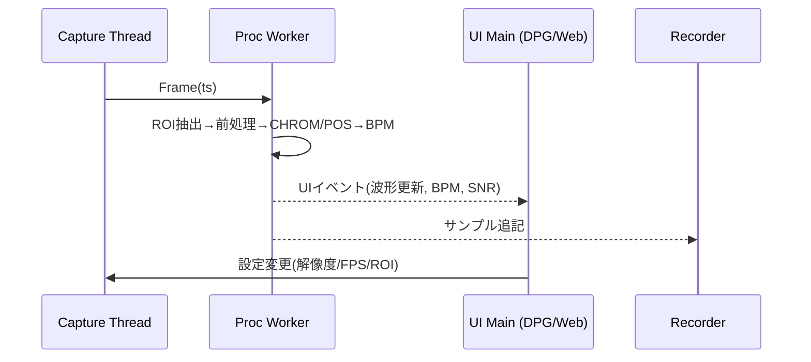
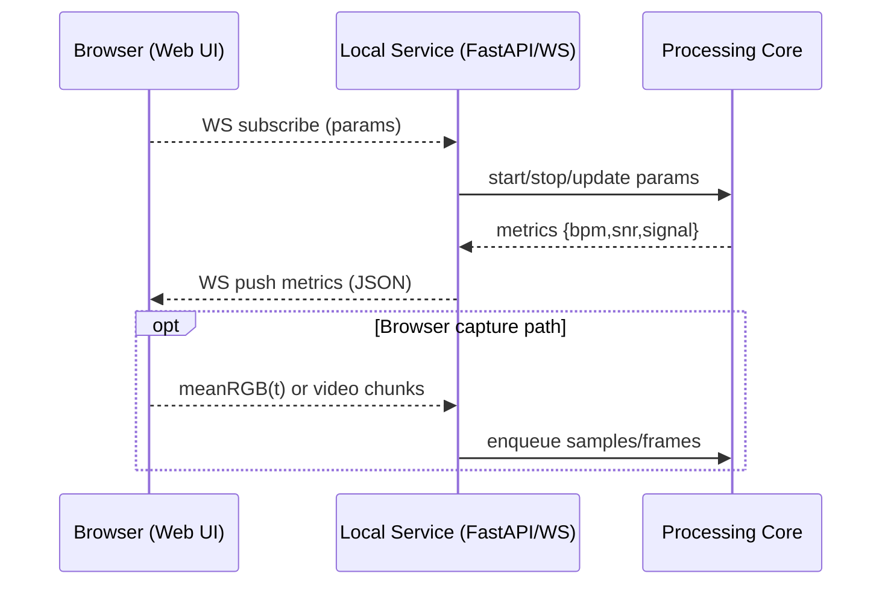

## rPPG デスクトップ/ブラウザ対応 設計

最終更新: 2025-08-24

本設計は uv + DearPyGUI を前提に、将来的なブラウザUI対応（Web）も見据えた拡張可能なアーキテクチャを示す。内蔵カメラから rPPG（CHROM/POS）を推定し BPM を表示・保存する。

## 全体アーキテクチャ（マルチフロントエンド）
```mermaid
flowchart TD
  subgraph Core[Processing Core]
    CAP[Capture Layer]
    ROI[ROI/Face Tracking]
    CORE[rPPG Core\n(Preprocess, CHROM/POS, Filter)]
    REC[Recorder\n(CSV/JSON)]
    CAP -->|Frame (BGR, ts)| ROI -->|ROI mean RGB, ts| CORE --> REC
  end
  subgraph Frontends
    DPG[Desktop UI\n(DearPyGUI)]
    WEB[Web UI\n(Browser)]
  end
  CORE -->|signal window, BPM, SNR| DPG
  CORE <-->|WS/HTTP JSON| WEB
  CAP -. optional .->|Browser getUserMedia| WEB
```

- Capture: カメラからフレーム＋タイムスタンプ取得、FPS計測
- ROI: 顔検出/ランドマーク、スキンマスク生成、複数パッチの追跡
- Core: 正規化・バンドパス・CHROM/POS合成・BPM推定・品質指標
- UI: プレビュー（ROI重畳）、波形/スペクトル、BPM/品質、設定（Desktop/Web いずれでも）
- Recorder: R/G/B 平均、rPPG、BPM を非同期保存

## スレッド/非同期モデル

- UIスレッドは描画と操作に限定。処理はWorkerで実行（`queue.Queue` で受け渡し）。
- 設定変更はスレッドセーフな共有構造（`dataclasses` + `threading.Lock`）で反映。

### Web 経路の追加（将来）

- 近接/ローカル運用ではコアがカメラを直接使用し、Browser はメトリクス受信主体。
- ブラウザでの映像取得が必要な場合は `getUserMedia` → `RTC/WS` で平均RGBや低ビットレート映像を送信し、帯域を節約。

## モジュール構成（`src/` 提案）
```
src/
  rppg/
    __init__.py
    capture.py        # OpenCV カメラ制御, FPS, 色空間変換
    roi.py            # MediaPipe顔検出/ランドマーク, スキンマスク, パッチ定義
    preprocess.py     # 正規化(移動平均), バンドパス(FIR/IIR)
    chrom.py          # CHROM 合成
    pos.py            # POS 合成
    bpm.py            # スペクトル/ピークトラッキング, BPM計算
    quality.py        # SNR等の品質指標
    recorder.py       # CSV/JSON 非同期書き込み
    app.py            # DearPyGUI エントリ, ループ, 配線
    service.py        # FastAPI/WebSocket サービス（Webフロント連携）
web/
  frontend/          # 将来: Web UI（静的アセット or SPA）
```

## データモデル
- Frame: `np.ndarray(BGR)`, `timestamp: float`
- RoiResult: `mask(s)`, `valid: bool`, `landmarks`
- Sample: `mean_rgb: (R,G,B)`, `timestamp`
- WindowResult: `signal: np.ndarray`, `bpm: float`, `snr: float`, `peak_f: float`
### Web API（JSON例）
- Subscribe: `{ "action": "start", "algo": "pos", "band": [0.7,4.0], "win": 2.0, "step": 1.0 }`
- Metrics push: `{ "t": 1735123.10, "bpm": 72.4, "snr": 5.8, "fps": 29.7 }`
- Optional signal chunk: `{ "t0": 1735123.0, "dt": 0.033, "signal": [..] }`

## 信号処理設計
- 正規化: $x_n(t) = x(t)/\overline{x}(t) - 1$（窓内移動平均）
- バンドパス: 0.7–4.0 Hz（IIR: Butterworth 2–4次／FIR: 0相）
- 合成:
  - CHROM: $X=3R_n-2G_n,\ Y=1.5R_n+G_n-1.5B_n,\ s=X-\alpha Y,\ \alpha=\sigma(X)/\sigma(Y)$
  - POS: $X=G_n-B_n,\ Y=-2R_n+G_n+B_n,\ s=X+\alpha Y$
- BPM: 心拍帯域でFFTピーク→連続窓で平滑化（メディアン/EMA）

## UI レイアウト（DearPyGUI）
- 左: カメラプレビュー（ROI枠/マスク重畳）
- 右上: BPM, SNR, FPS
- 右中: 波形プロット、下: スペクトル
- 右下: 設定パネル（アルゴリズム、窓長/ステップ、帯域、BPM範囲、記録）
### Web UI の考慮
- 同レイアウトをWebでも踏襲（Canvas/Chartで波形/スペクトル）。
- 初期はメトリクス推移＋現在値の可視化から開始、後にROIプレビューを追加。

## 主要パラメータ（初期値）
- 窓長/ステップ: 2.0s / 1.0s（50%重なり）
- 帯域: 0.7–4.0 Hz、BPM範囲: 42–240
- ROI: 頬×2＋額、重み=面積 or 分散逆数

## エラーハンドリング
- カメラ未接続/権限: UI通知＋再試行
- 顔未検出: 前回ROI保持→タイムアウトで停止/再検出
- FPS不足: 自動ダウンサンプリング、BPM上限を `0.45×FPS` に制限

## ログ/保存
- CSV: `timestamp,R,G,B,signal,bpm,snr`
- JSONメタ: 設定、開始/終了時刻、デバイス情報
### Web 配信
- ライブメトリクスは WS 経由、履歴はバックエンドから JSON/CSV ダウンロードを提供。

## 将来拡張
- マルチパッチのロバスト合成（RANSAC/重み最適化）
- 動き補償（光フロー）/自動WB固定
- 品質に基づく適応窓長
