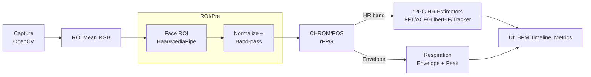
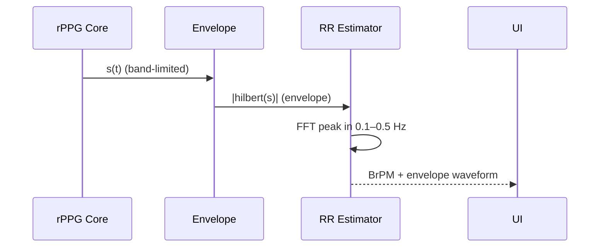
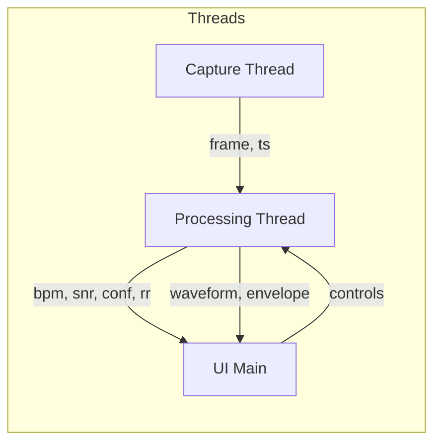

## 技術設計（理論とアルゴリズム）

最終更新: 2025-08-26

本書は本リポジトリに実装したrPPG（remote PPG）に基づく心拍数（HR: BPM）および呼吸数（RR: BrPM）推定の技術的背景・アルゴリズムを簡潔にまとめる。実装は Python/NumPy/Scipy を用い、UIは DearPyGUI。主要コンポーネントとAPIは `src/rppg/` 配下にある。

---

## 1. 全体パイプライン

1) キャプチャ: カメラからフレーム取得（OpenCV）。RGBへ変換しタイムスタンプ付与（`capture.py`）
2) ROI抽出: 顔検出（OpenCV Haar or MediaPipe）により頬/額のマスクを生成（`roi.py`）
3) 平均RGB: ROI内の画素平均から R,G,B の時系列を取得（`roi.mean_rgb`）
4) 前処理: DC除去（移動平均比）→ バンドパス（HR帯: 0.7–4.0 Hz）で雑音除去（`preprocess.py`）
5) カラー射影: CHROM/POS により単一のrPPG信号へ合成（`chrom.py`/`pos.py`）
6) HR推定: FFT/ACF/Hilbert-IF/Tracker のいずれかで BPM を推定（`bpm.py`, `acf_bpm.py`, `hilbert_if.py`, `tracker.py`）
7) 品質推定: スペクトルSNR/ピーク信頼度の算出（`quality.py`）
8) RR推定: rPPG包絡の低周波を解析し BrPM を推定（`respiration.py`）
9) UI表示: プレビュー、rPPG波形、BPMタイムライン、RR、品質指標、各種設定（`app.py`）



---

## 2. 前処理（`preprocess.py`）

- DC除去（移動平均比）: 入力 x(t) と窓長 T に対して、移動平均 m(t) を用いて x_n(t) = x(t)/m(t) − 1 を算出。ゆっくりした照明変動に頑健。
- バンドパス: HR帯（既定 0.7–2.0/4.0 Hz）を IIR（Butterworth）で通過。リアルタイム性のため因果フィルタ（`lfilter`）を使用（ゼロ位相は非適用）。

---

## 3. カラー射影（`chrom.py`, `pos.py`）

CHROM/POS は Wang, Stuijk, de Haan (TBME 2016) に基づく。R,G,B の正規化系列 R_n,G_n,B_n から、固定係数の線形結合でrPPGを得る。

- CHROM（例）:
  - X = 3R_n − 2G_n
  - Y = 1.5R_n + G_n − 1.5B_n
  - α = σ(X)/σ(Y)
  - s = X − αY

- POS（例）:
  - X = G_n − B_n
  - Y = −2R_n + G_n + B_n
  - s = X + αY （αは分散比、定義は実装参照）

どちらも皮膚の反射特性から心拍由来成分のコントラストを最大化する設計で、実装では数式に忠実な形で簡潔に実装している。

---

## 4. HR推定の手法

実装は複数の推定器を切り替え可能。UIから Estimator として選択する。

### 4.1 FFTピーク（`bpm.py`）
- 窓内の rPPG 信号 s(t) にハニング窓を掛けFFT。
- 心拍帯（fmin..fmax）内で最大ピーク周波数 f_peak を検出。
- BPM = 60·f_peak。連続窓での中央値/EMA平滑はUI側のタイムラインで吸収。
- 長所: 実装が単純。短所: 非定常・短窓での分解能が不足。

### 4.2 ACF（`acf_bpm.py`）
- 自己相関（Wiener–Khinchin; |FFT|^2の逆FFT）で正ラグの主ピークを探索。
- 心拍帯に対応するラグ範囲のみ探索し、二次補間でサブサンプル推定。
- 長所: 短窓や雑音に比較的強い。短所: 周期性が弱いと不安定。

### 4.3 Hilbert-IF（`hilbert_if.py`）
- 解析信号 a(t)=hilbert(s(t)) の位相 φ(t)=arg a(t) を unwrap。
- 瞬時周波数 IF = (fs/2π)·dφ/dt を数値微分で計算し、BPM=60·IF。
- 微分の安定化に移動平均（平滑長はUIで調整）。
- 長所: サンプル毎のBPMが得られ応答が速い。短所: 位相ノイズに弱い。

### 4.4 Tracker（`tracker.py`）
- 周波数 f とそのドリフト f_dot を状態とした線形ガウスモデル（α-β相当）。
- 観測 z は FFT/ACF/IF のいずれか。品質（SNR/Conf）から観測ノイズRを可変化。
- predict(dt): x←F·x, P←F·P·F^T+Q。update(z): K = P·H^T(S^−1), x←x+K(y)。
- 長所: 非定常/外乱に対して平滑に追従。短所: パラメータ（Q/R）の整合が必要。

```mermaid
flowchart TD
  s[rPPG s(t)] -->|Estimator| z[Measurement f_meas]
  z -->|quality→R| KF[FreqTracker\n(f, f_dot)]
  KF --> bpm[BPM = 60·f]
  subgraph Quality
    SNR[SNR]
    CONF[Peak Confidence]
  end
  SNR --> KF
  CONF --> KF
```

---

## 5. 品質指標（`quality.py`）

- SNR（dB）: ピーク帯域の平均値を信号、ガード外の中央値を雑音とし 10log10(S/N) を算出。
- Peak confidence: ピークと近傍中央値の対比（0..1）で局所的な顕著さを表現。

---

## 6. 呼吸数（RR）推定（`respiration.py`）

- ヒルベルト包絡: HR帯で帯域通過した rPPG の解析信号の振幅 envelope を計算。
- 低周波帯（0.1–0.5 Hz; 6–30 BrPM）でスペクトルピークを探索し BrPM=60·f_peak。
- 代替: ACF/IF/Tracker を envelope に適用可能（将来的に拡張）。
- UI: RR を BPM/SNR/Conf と同列で表示。デバッグ用に envelope 波形を −win..0 秒で表示。



---

## 7. UIとリアルタイム動作（`app.py`）

- スレッド分離: キャプチャ/処理/描画を分離し、deque/Lockで低遅延に連携。
- プレビュー: ROI矩形を重畳表示。映像は軽量な内部テクスチャへ縮小転送。
- プロット:
  - rPPG波形（BPM算出前; Y軸±0.005固定）
  - BPMタイムライン（表示ソース=推定器 or トラッカー; 40–120 BPM固定）
  - Respiration波形（包絡; X軸 −win..0 固定）
- スペクトル表示: 安定性のためUIから一時的に無効化（要求に応じて再有効化）。
- ウィンドウ長: 1–15秒。初期値8秒。RR安定化に有効。



---

## 8. 主要パラメータ（UIから調整可）

- HR帯域: fmin/fmax（Hz）
- Estimator: FFT / ACF / Hilbert-IF / Tracker(FFT|ACF|IF)
- IF平滑長: 秒指定（サンプリングに応じてサンプル数化）
- Tracker: q_freq, q_drift, r_meas（品質に応じてRを可変）
- 品質→R写像: Source（SNR/Conf/積）、floor、SNRスケール
- RR帯域: 0.1–0.5 Hz（実装デフォルト）

---

## 9. 参考文献

- X. Wang, E. Stuijk, and G. de Haan, “A Novel Algorithm for Remote Photoplethysmography,” IEEE Trans. Biomed. Eng., 2016.
- O. de Haan ほか、rPPGに関する関連研究。

---

## 10. 実装ファイル対応

- `rppg/capture.py`: カメラ入出力、FPS推定、タイムスタンプ
- `rppg/roi.py`: 顔検出と頬/額マスク、平均RGB計算
- `rppg/preprocess.py`: 移動平均比による正規化、バンドパス
- `rppg/chrom.py`/`rppg/pos.py`: カラー射影
- `rppg/bpm.py`: FFTピーク由来のBPM推定
- `rppg/acf_bpm.py`: 自己相関ベースのBPM推定
- `rppg/hilbert_if.py`: 瞬時周波数ベースのBPM推定
- `rppg/tracker.py`: 周波数トラッカー（α-β/Kalman風）
- `rppg/quality.py`: SNR/ピーク信頼度
- `rppg/respiration.py`: 呼吸包絡とRR推定
- `rppg/app.py`: UI/制御ロジック統合
