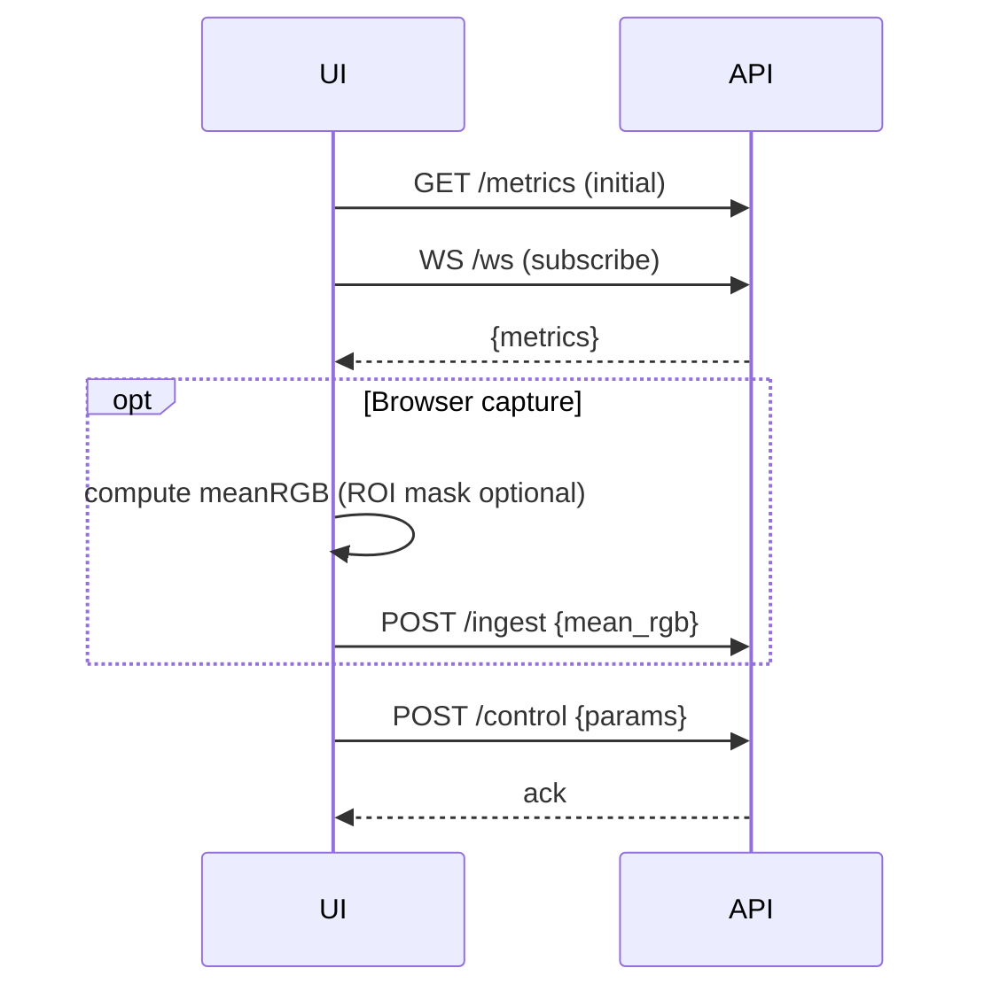

## Webアプリ仕様（ユーザが気軽に扱える形へ）

最終更新: 2025-08-26

目的: デスクトップと同等のコア推定品質を保ちつつ、ブラウザからの閲覧/操作でrPPGのBPM/RR/品質を手軽に確認できるWebアプリ体験を提供する。

---

## 1. ユースケース/UX

- 計測ダッシュボード
  - 現在値: BPM, RR, SNR/Conf, FPS
  - タイムライン: HR（選択ソース=推定器/トラッカー）, RR（任意表示）
  - 状態: 接続/カメラ/デバイス名/エラー
- 操作
  - 推定器選択（FFT/ACF/H-IF/Tracker）
  - 窓長/帯域/IF平滑/Tracker Q,R/品質→R写像/ROI選択（ON/OFF）
  - 記録（CSV/JSON）開始/停止
- プレビュー
  - ROIオーバレイ付きの縮小プレビュー（ON/OFF）。低帯域/低FPSに間引き。
  - デスクトップの代替として、ブラウザ内ヒントで姿勢/光環境の注意を表示。

---

## 2. デプロイ/ランモード

- ローカルサービス: FastAPI（localhost:8000）+ 静的フロント（web/frontend）
- ブラウザキャプチャ（オプション）: getUserMediaで平均RGBをクライアント側計算→軽量に送信
- サーバキャプチャ: サービス側でカメラを掴み、メトリクスのみを配信

```mermaid
flowchart LR
  subgraph Local Service
    API[FastAPI\n/metrics,/ws,/control]
    CORE[rPPG Core]
  end
  UI[Web UI\n(HTML/JS)] -- WS/HTTP --> API
  UI -- getUserMedia? meanRGB/samples --> API
  API -- frames/meanRGB --> CORE
  CORE -- metrics/signal --> API --> UI
```

---

## 3. API 仕様（FastAPI）

- GET `/metrics`
  - 応答: `{ bpm: number|null, rr: number|null, snr: number, fps: number, algo: string, est: string, t: number }`
- WS `/ws`
  - 受信（サブスクライブ）: `{ action: 'start'|'stop'|'update', params?: {...} }`
  - 送信（メトリクス）: `{ type: 'metrics', bpm, rr, snr, fps, t }`
  - 送信（信号チャンク; 任意）: `{ type: 'signal', t0, dt, signal: number[] }`
- POST `/control`
  - 受信: `{ algo, est, win_sec, band_hz, if_smooth_sec, tracker: {q_freq,q_drift,r_meas}, quality: {mode,floor,snr_scale}, roi: {...} }`
  - 応答: 200 OK / 400（検証エラー）
- POST `/ingest`
  - ブラウザキャプチャ用: `{ t0, dt, mean_rgb: [number,number,number][] }` を受信し、コアへ追加

バリデーション/制限
- `win_sec`: 1–15
- `band_hz`: 0.4–5.0（下限<上限）
- `est`: `FFT|ACF|Hilbert-IF|Tracker(FFT|ACF|IF)`
- レート制限（WS送信は~5–10Hz, signalは間引き/上限長）

---

## 4. フロントエンド仕様

- 技術: バニラJS + ECharts/Chart.js（軽量UI）
- レイアウト
  - 左: プレビュー（Canvas, ROI矩形）
  - 右: メトリクス（BPM/RR/SNR/Conf/FPS）とコントロール（select/slider）
  - 下: タイムライン（BPM, RR）
- 動作
  - 初期ロードで `/metrics` をポーリング（フォールバック）
  - WS接続時はプッシュ受信で更新
  - getUserMedia有効時は 平均RGBを 10–30Hz で計算し `/ingest` 送信（任意）



---

## 5. コア連携と設計方針

- サービスは既存 `rppg.*` を再利用。キャプチャ経路は2系統（ローカル or ブラウザ平均RGB）
- スレッド/キューはデスクトップと同様、UI層だけがWebに置換
- 指標（BPM/RR/SNR/Conf/FS）はWSで~5–10Hz配信し、描画負荷と帯域を制御
- 記録: サービス側でCSV/JSON（既存Recorder）を使用

---

## 6. セキュリティ/プライバシー

- 既定はローカルホストのみバインド（127.0.0.1）
- CORSをlocalhost/127.0.0.1に限定（開発時のみ緩める）
- ブラウザキャプチャ時も動画自体を送らず、平均RGB/低解像度ROIなど最小限に限定
- 保存対象はメトリクス/平均RGB/派生信号のみ（動画保存は行わない）

---

## 7. 非機能要件

- 低遅延: UI更新5–10Hz、バックエンド処理1ステップ<20ms（平均）
- 可用性: WS切断の自動再接続、バックプレッシャー時は間引き
- ポータビリティ: uv + FastAPIでワンクリック起動（`uv run task serve`）

---

## 8. 実装タスク（Web）

- サービスAPI: `/metrics`, `/ws`, `/control`, `/ingest`（型/検証を実装）
- メトリクス配信: バックグラウンドで最新値の推定とバッファ
- フロント: WebSocket接続、メトリクス描画、コントロール送信、getUserMedia平均RGB
- ROI: ブラウザ側簡易ROI（Canvasで顔矩形 or スキン領域; 任意）
- レート制御/デバウンス/間引き
- ドキュメント/チュートリアル/注意事項（照明・姿勢・プライバシー）

